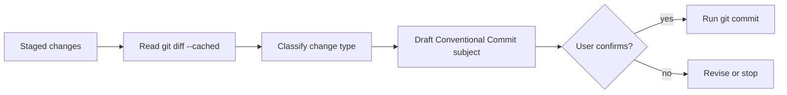

# Conventional Commit Skill

Generates Conventional Commit messages from staged git changes and commits only after explicit user confirmation.

## When To Use

Use this skill when the user asks to commit changes, craft a commit message, stage work into commits, or split work into Conventional Commit units.

## Workflow



## Commit Format

```text
<type>(<optional-scope>): <description>
```

Supported types include `feat`, `fix`, `docs`, `style`, `refactor`, `test`, and `chore`.

## Operating Rules

- Analyze only staged changes with `git diff --cached`.
- Use imperative mood in the subject.
- Keep the subject concise.
- Ask for explicit confirmation before committing.

## Source Contract

See [`SKILL.md`](SKILL.md) for the executable skill instructions.
