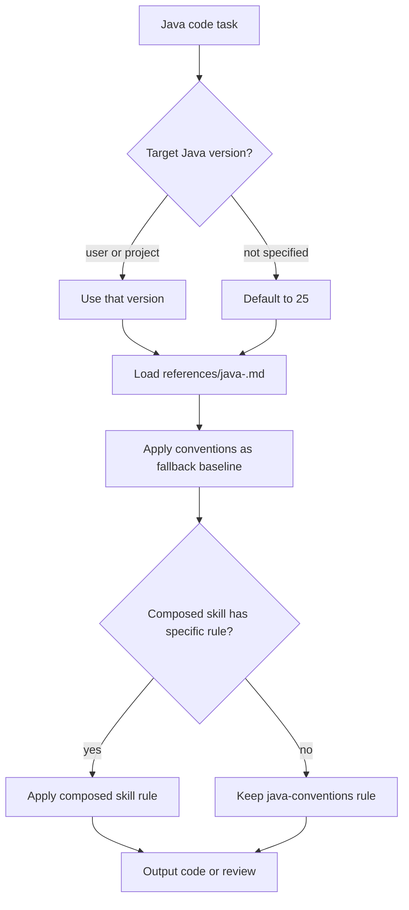

# Java Conventions

Enforces versioned, idiomatic Java language conventions for writing, generating, or reviewing Java code.

## When To Use

Use this skill when the user asks about Java style, Java conventions, idiomatic Java, modern Java, Java 25, or any request to write or review Java code where context-specific skills do not already cover style. Use it as the fallback baseline and compose it with framework- or architecture-specific skills.

## Workflow

## Version Selection

1. Use the version the user explicitly mentions.
2. Otherwise, read the version from project files (`pom.xml`, `build.gradle`, `module-info.java`, `README.md`, `system.properties`).
3. Default to **25** if no version is found.

## Bundled References

- Java 25 — [`references/java-25.md`](references/java-25.md)

Newer or older Java versions can be added as additional reference files under `references/java-<version>.md` and loaded via progressive disclosure.

## Scope

- Language-level rules only: syntax, style, naming, visibility, structure, methods, streams, exceptions, comments.
- Not build, packaging, framework, protocol, or architecture rules.
- Composed skills win when they specify a rule; this skill is the fallback baseline.

## Source Contract

See [`SKILL.md`](SKILL.md) for the executable skill instructions and [`references/java-25.md`](references/java-25.md) for the Java 25 conventions catalog.

## Credits

The Java 25 conventions reference is adapted from [Adam Bien's `airails` Java conventions](https://github.com/AdamBien/airails/tree/main/java/java-conventions).
