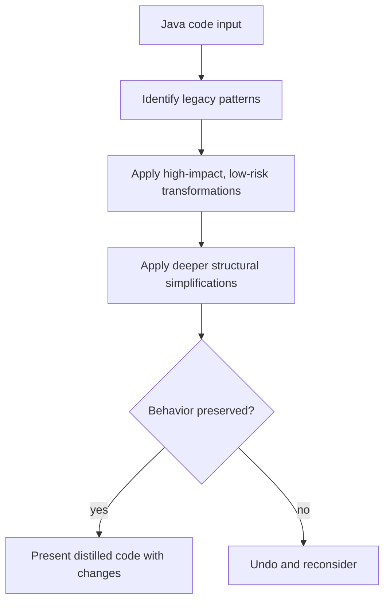

# Java Distiller

Simplifies, modernizes, refactors, and beautifies Java code while preserving its behavior.

## When To Use

Use this skill when asked to distill, simplify, modernize, upgrade, refactor, clean up, beautify, or improve existing Java code.

## Workflow

## Transformation Order

1. Syntax modernization — `var`, text blocks, switch expressions, pattern matching
2. API upgrades — `java.time`, `HttpClient`, factory methods, `Optional`, `Stream`
3. Pattern adoption — records, sealed interfaces, pattern matching
4. Functional style — streams, lambdas, method references
5. Concurrency modernization — virtual threads, structured concurrency, scoped values
6. Structural simplification — flatten, inline, remove dead code

## Core Rules

- Preserve behavior exactly.
- Remove complexity, don't add new abstractions.
- Use modern Java 21+ features only when they simplify the code.
- Do not introduce new dependencies.
- Avoid comments, Javadoc, logging, or error handling that wasn't already there.
- Stop when the code is already clean and modern.

## Source Contract

See [`SKILL.md`](SKILL.md) for the executable skill instructions and [references/transformations.md](references/transformations.md) for the transformation catalog.
