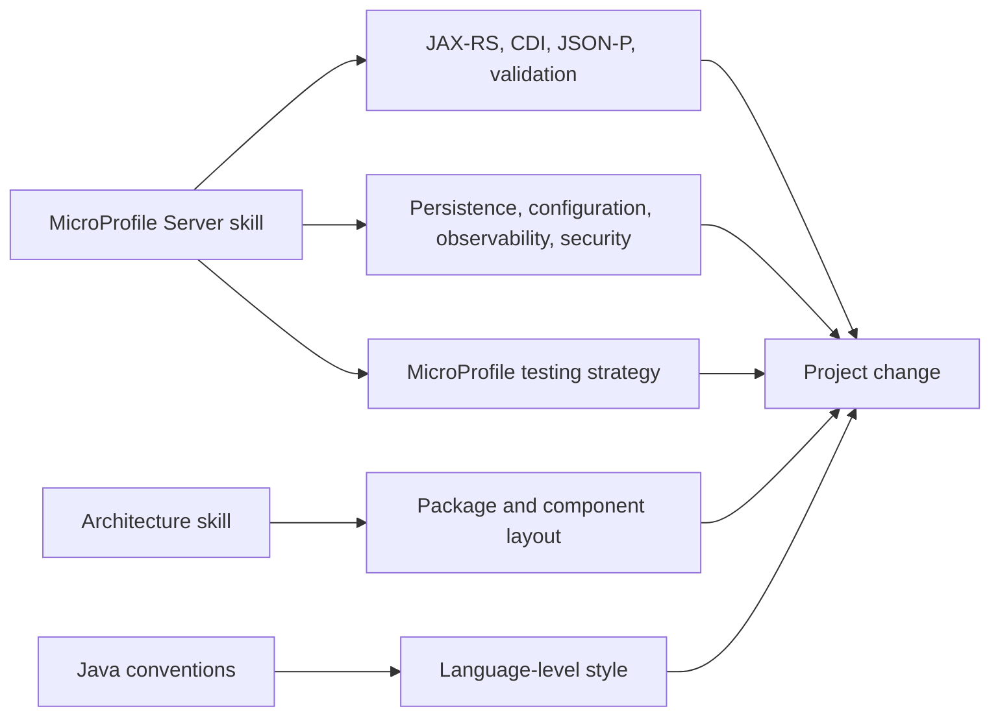
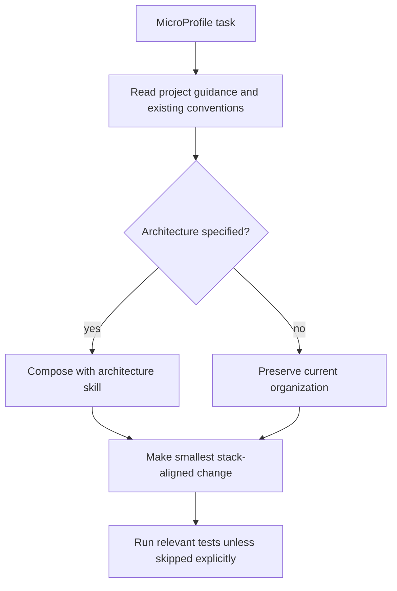

# MicroProfile Server Skill

Defines stack-specific coding rules for long-running Java MicroProfile / Jakarta EE server applications while preserving the project's selected architecture.

## When To Use

Use this skill when creating, generating, scaffolding, writing, migrating, troubleshooting, or reviewing MicroProfile / Jakarta EE server code.

## Composition

## Request Flow

## Core Rules

- Treat MicroProfile as the application stack, not the architecture.
- Preserve existing package organization unless the user asks for an architecture change.
- Prefer JAX-RS `WebApplicationException` subclasses and `ExceptionMapper` for HTTP errors.
- Keep business logic out of JAX-RS resources and transport details out of application/domain code.
- Use existing project dependency, test, JSON, validation, and configuration conventions.

## Source Contract

See [`SKILL.md`](SKILL.md) for the executable skill instructions.
