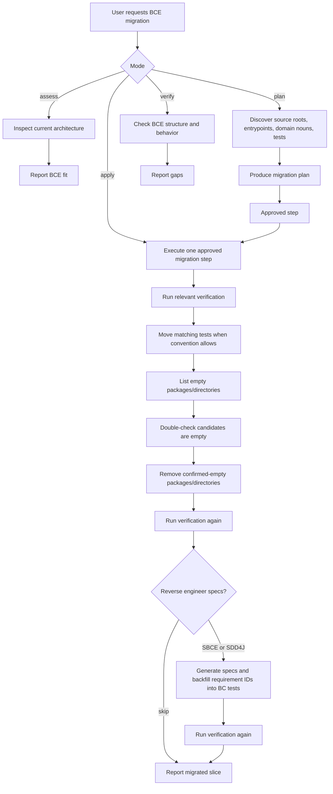
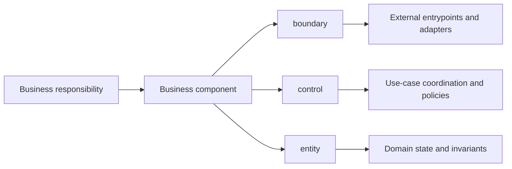

# Migrate To BCE Skill

Plans and applies incremental migrations from an existing architecture to Boundary-Control-Entity architecture without changing observable behavior unnecessarily.

## When To Use

Use this skill when the user asks to migrate, port, refactor, restructure, reorganize, or convert a codebase to BCE, ECB, business components, or `boundary/control/entity` layers.

## Workflow

## Migration Model

## Core Rules

- Produce a migration plan before changing code unless an approved plan already exists.
- Identify business responsibilities before moving folders.
- Use read-only subagents for broad discovery or independent review on larger repositories when available.
- Preserve public APIs, routes, schemas, data formats, and shipped behavior unless the user approves a breaking change.
- Move directly associated tests as part of each migration slice when project conventions allow mirrored ownership.
- Remove source/test packages or directories that became empty because of the migration slice only after double-checking they are still empty.
- When reverse engineering migrated BCs into SBCE or SDD4J specs, add the generated requirement IDs to the respective migrated BC tests using the selected workflow's traceability convention.
- Compose with stack skills for build, test, framework, and language rules.

## Source Contract

See [`SKILL.md`](SKILL.md) for the executable skill instructions.
