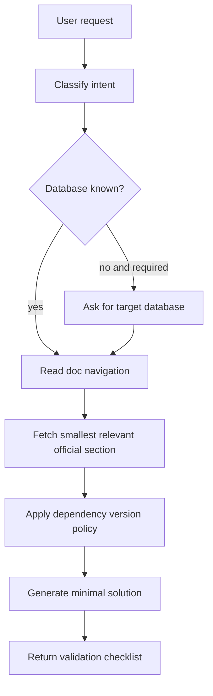
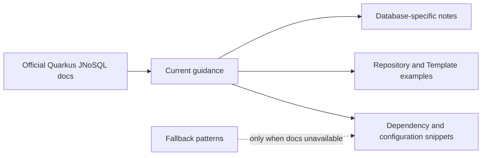

# Quarkus JNoSQL Skill

Guides Quarkus applications that use Quarkus JNoSQL, Eclipse JNoSQL, Jakarta NoSQL, or Jakarta Data repositories while treating the official documentation as the source of truth.

## When To Use

Use this skill for Quarkus JNoSQL creation, review, migration, troubleshooting, dependency setup, repository usage, template usage, database-specific setup, and native-image questions.

## Workflow

## Documentation Policy

## Core Rules

- Prefer current official docs over embedded examples.
- Retrieve only the smallest section needed for the request.
- Preserve existing project BOMs, catalogs, and versions.
- Do not infer extension versions from memory, caches, snapshots, or unrelated examples.
- Verify database-specific support for Jakarta Data, Template type, and native compilation.

## Source Contract

See [`SKILL.md`](SKILL.md) for the executable skill instructions.
