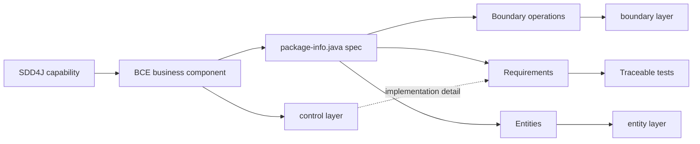

# SDD4J BCE Skill

Maps an SDD4J Java capability spec to a Boundary-Control-Entity business component.

## When To Use

Use this architecture adapter when a Java project organizes capabilities as BCE business components with component-local `boundary`, `control`, and `entity` layers.

## Mapping



## Default Layout

```text
src/main/java/<base>/<component>/
  package-info.java
  boundary/
  control/
  entity/
```

## Core Rules

- One SDD4J capability maps to one BCE business component.
- `## Boundary` maps only to boundary-layer operations.
- `## Entities` maps to contract-relevant types in the entity layer.
- `control` is implementation detail and has no spec section.
- Requirement ids must be visible in tests according to the stack convention.
- Do not mix BCE, feature-package, and layered adapters inside one capability.

## Source Contract

See [`SKILL.md`](SKILL.md) for the executable skill instructions.
