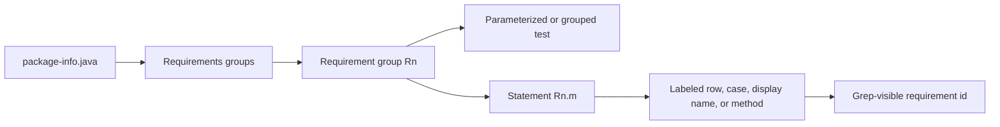
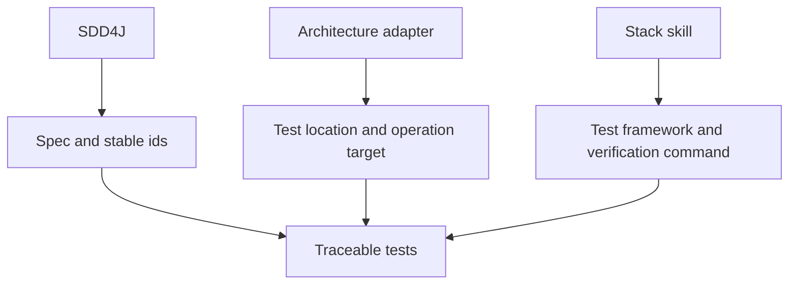

# SDD4J EARS Tests Skill

Generates traceable Java tests from SDD4J EARS requirement statements.

## When To Use

Use this skill when `package-info.java` capability specs contain `## Requirements` groups with ids like `R1.1` and tests must be parameterized, table-driven, or grep-traceable.

## Transform

## Composition

## Core Rules

- One requirement group maps to one parameterized, table-driven, or grouped test skeleton when appropriate.
- One statement id maps to one labeled row, case, display name, method name, JavaDoc, or annotation.
- Preserve the requirement id exactly in test source.
- Do not coin requirement ids or edit the spec.
- Report orphan test ids as drift.

## Source Contract

See [`SKILL.md`](SKILL.md) for the executable skill instructions.
