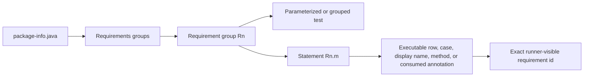
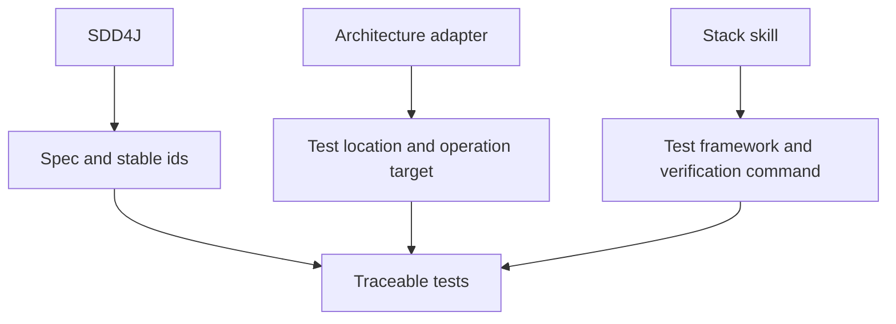

# SDD4J EARS Tests Skill

Generates traceable parameterized Java tests from SDD4J EARS requirement statements.

## When To Use

Use this skill when `package-info.java` capability specs or other EARS acceptance criteria contain requirement groups with ids like `R1.1` and need parameterized or table-driven tests with exact runner-visible traces.

## Transform

```mermaid
flowchart LR
  A[package-info.java] --> B[Requirements groups]
  B --> C[Requirement group Rn]
  C --> D[Parameterized or grouped test]
  C --> E[Statement Rn.m]
  E --> F[Executable row, case, display name, method, or consumed annotation]
  F --> G[Exact runner-visible requirement id]
```

## Composition

```mermaid
flowchart TD
  S[SDD4J] --> A[Spec and stable ids]
  M[Architecture adapter] --> B[Test location and operation target]
  T[Stack skill] --> C[Test framework and verification command]
  A --> D[Traceable tests]
  B --> D
  C --> D
```

## Core Rules

- One requirement group maps to one parameterized, table-driven, or grouped test skeleton when appropriate.
- Each EARS statement determines the row's arrange, act, assert, and role fields; do not invent contract values absent from the spec or existing code.
- Every statement id resolves to at least one exact runner-visible test identity.
- A trace may use the literal id or a symbol whose display form is the literal id.
- JavaDoc and comments alone do not count as traceability.
- Trace coverage is complete in both directions: every statement has a trace, and every literal or symbolic trace resolves to an existing statement.
- Preserve the requirement id exactly in the runner-visible identity; normalized Java symbols are valid only when their configured display form resolves to the literal id.
- Do not coin requirement ids or edit the spec.
- Prefer an explicit failing TODO or red test over fabricated fixtures or assertions when the prose is insufficient.
- Report orphan test ids as drift.

## Source Contract

See [`SKILL.md`](SKILL.md) for the executable skill instructions.
