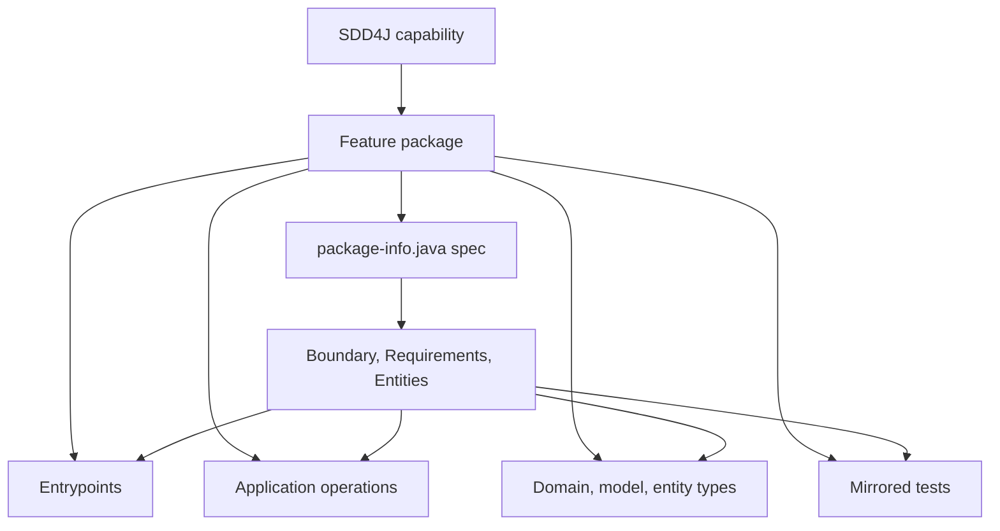

# SDD4J Package By Feature Skill

Maps an SDD4J Java capability to one feature-owned package.

## When To Use

Use this architecture adapter when each feature or capability owns a package containing its spec, entrypoints, application code, domain/model code, and tests.

## Mapping



## Default Layout

```text
src/main/java/<base>/<capability>/
  package-info.java
  web/
  application/
  domain/
  persistence/

src/test/java/<base>/<capability>/
```

## Core Rules

- One SDD4J capability maps to one Java feature package.
- The feature package is the default ownership boundary.
- The spec lives in the feature package's `package-info.java`.
- Contract-relevant code belongs in or below the feature package unless `AGENTS.md` declares an exception.
- Shared packages are exceptional and must be declared or treated as cross-cutting implementation.

## Source Contract

See [`SKILL.md`](SKILL.md) for the executable skill instructions.
