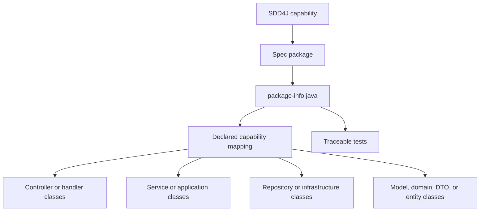
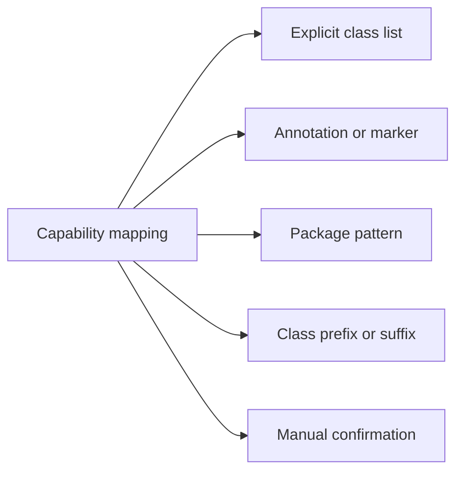

# SDD4J Package By Layer Skill

Maps an SDD4J capability spec to Java classes spread across technical layer packages.

## When To Use

Use this architecture adapter for existing layered Java applications where controllers, services, repositories, models, DTOs, and infrastructure are intentionally separated by technical package.

## Mapping

## Mapping Strategies

## Core Rules

- One capability maps to one spec package plus one declared set of layer classes.
- The spec package is the capability identity even when implementation code lives elsewhere.
- A class belongs to a capability only when the configured mapping says it does.
- Prefer explicit `AGENTS.md` mapping; do not rely on class-name guessing as a stable operating mode.
- Report ambiguous mapping as uncertainty instead of editing code or specs speculatively.

## Source Contract

See [`SKILL.md`](SKILL.md) for the executable skill instructions.
