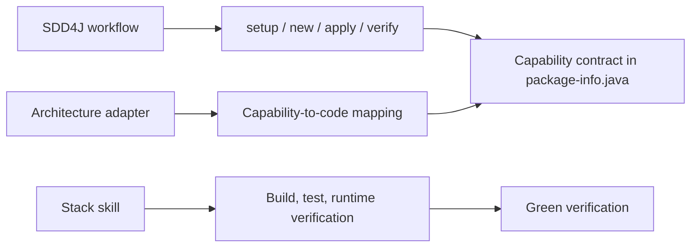
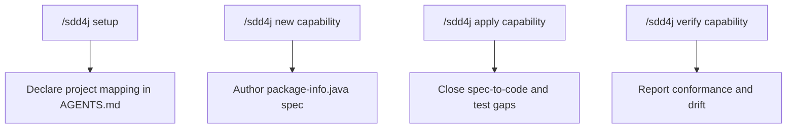

# SDD4J Skill

Drives Spec-Driven Development for Java using `package-info.java` as the co-located capability contract.

## When To Use

Use this skill for SDD4J setup, new capability specs, applying specs to code, verifying code against specs, EARS requirements, and traceable Java tests.

## Composition

## Modes

## Spec Contract

An SDD4J capability spec defines:

- `## Boundary` transport-neutral operations.
- `## Requirements` EARS statements with stable ids such as `R1.1`.
- `## Entities` contract-relevant domain concepts when needed.
- `## Out of scope` explicit non-goals when needed.
- Optional `AGENTS.md` spec language for localized EARS prose.

## Core Rules

- The spec is the source of truth for intended behavior.
- One capability has one spec.
- Every requirement id must be grep-visible in at least one test.
- EARS patterns are semantic and may be localized when configured.
- `apply` writes the correct implementation to pass new traceable tests.
- Code-to-spec drift is reported, not silently absorbed into the spec.
- Done means stack verification is green and no structural gap or drift remains.

## Source Contract

See [`SKILL.md`](SKILL.md) for the executable skill instructions.
