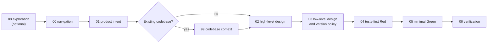
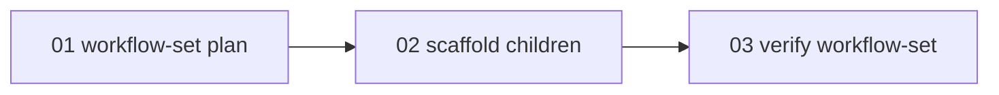

# SLDD Skill

SLDD is a runtime skill for **Spec Loops Driven Development**: a gated, specs-driven workflow for AI-assisted software delivery.

It keeps exploration, product intent, architecture, test design, implementation, and verification in separate phases so agents can move quickly without skipping review gates.

This implementation is based on Loiane Groner's article [Vibe Coding, But Production-Ready: A Specs-Driven Feedback Loop for AI-Assisted Development](https://loiane.com/2026/03/vibe-coding-with-specs-driven-feedback-loops/).

## Commands

SLDD accepts slash-style commands when they reach the skill as text:

```text
/sldd
/sldd help
/sldd status
/sldd start <feature>
/sldd resume <feature>
/sldd resume
/sldd continue
/sldd run step <step-id> <feature>
/sldd run step <step-id>
/sldd step <step-id>
/sldd explore [idea]
```

Commands are routing shortcuts. They do not bypass workflow gates, approval rules, journal checks, or Red/Green contracts.

Numeric step values are accepted as shorthand and resolve to the canonical step ID for the workflow kind. Journal `steps` keys use the canonical step ID, which is the step file basename without `.md`. The current step is derived from `steps` and workflow gate rules instead of being persisted separately.

Use `/sldd help` for a non-mutating overview. It must not load workflow or step files and must not create or change workflow state.

Use `/sldd explore [idea]` for Step 88 exploration before formal Step 01. Exploration establishes project context, inspects the repository before asking questions the codebase can answer, asks one focused question at a time, and offers explicit exits: continue exploring, formalize Step 01, save an optional summary after approval, route to Step 99, or stop without saving.

When exploration reveals multiple capabilities, dependencies, parallel workstreams, or an oversized Step 01, SLDD recommends workflow-set planning. Exploration does not create workflow-set artifacts without explicit approval.

## Architecture

SLDD is one executable skill:

`SKILL.md` is the router. It detects the workflow name and kind for new journals, reads required `name` and `kind` from existing journals, validates journal state, interprets commands, and loads only the workflow and step needed for the current action.

Runtime content is split by responsibility:

| Path | Responsibility |
|---|---|
| `SKILL.md` | Single executable router |
| `workflows/` | Workflow-specific ordering, gates, resume rules, and step maps |
| `steps/<kind>/` | Step behavior, approval protocol, save flow, and response format |
| `templates/` | Markdown artifact formats |
| `schema/_spec-journal.schema.json` | Structured journal contract |

The router uses progressive disclosure:

```text
SKILL.md
  -> workflows/<kind>.md
    -> steps/<kind>/<current step of the workflow kind>.md
      -> templates/<artifact>.md only when writing that artifact
```

Do not create additional executable SLDD skills. `SKILL.md` remains the only entrypoint.

The current runtime package has no application code, package manager, build pipeline, or secondary runtime entrypoint. It is a documentation-first skill package made of the router, workflow files, step files, artifact templates, the journal schema, repository documentation, evaluations, and the local installer.

## Workflow Kinds

SLDD supports two workflow kinds:

| Kind | Use for |
|---|---|
| `feature` | Isolated features, bugfixes, endpoints, business rules, local refactors, component documentation, and other single-workflow changes |
| `workflow-set` | Large initiatives, products, epics, multi-module work, broad system plans, decomposition requests, and work that needs child workflows |

Every `_spec-journal.json` must include `name` and `kind`. `name` is the workflow/spec name. New journals persist `name` and `kind` as soon as the workflow is created, and existing journals use `kind` as the workflow type source of truth. Journals without `name` or `kind` are invalid; SLDD does not provide a fallback to `feature` or a legacy compatibility mode for missing `kind`.

When the request is ambiguous, SLDD chooses `feature` unless the user clearly asks for decomposition or the work has multiple independent deliverables.

## Completion and Resume Selection

Workflow completion is defined by `kind`:

| Kind | Complete when |
|---|---|
| `feature` | `steps["06-verification"].status == "complete"` |
| `workflow-set` | `steps["03-verify-workflow-set"].status == "complete"` |

SLDD uses this kind-specific completion rule when filtering active workflows, validating predecessor gates, and resolving `/sldd resume`.

For `/sldd resume` without a workflow name, SLDD:

1. Finds all journals under `.sldd/specs/*/_spec-journal.json`.
2. Excludes workflows already complete for their `kind`.
3. Checks `relationships.predecessors` for each remaining workflow.
4. Treats a workflow as unblocked when it has no predecessors, or when every predecessor journal exists and is complete by its own workflow kind.
5. Automatically resumes only when exactly one active workflow is unblocked.
6. Asks the user to choose when multiple active workflows are unblocked.
7. Reports the blocking predecessor chain when no active workflow is unblocked.

A complete `workflow-set` parent means parent planning, child scaffolding, and coordination verification are complete. It does not mean child `feature` workflows are complete; child progress is computed by reading child journals.

## Feature Workflow

Feature workflows use this route:



Formal gate order is:

```text
01 -> 99 when needed -> 02 -> 03 -> 04 -> 05 -> 06
```

Step 99 is required before Step 02 for existing codebases. It may run during Step 88 when brownfield context is needed, but it satisfies the gate only after `existing-codebase-understanding.md` is approved, saved, current, and marked complete.

Feature step files:

| Step ID | File | Purpose |
|---|---|---|
| `88-exploration` | `steps/feature/88-exploration.md` | Clarify rough ideas before formal Step 01 |
| `00-navigation` | `steps/feature/00-navigation.md` | Inspect state and route |
| `01-product-intent` | `steps/feature/01-product-intent.md` | Product intent and acceptance criteria |
| `99-codebase-context` | `steps/feature/99-codebase-context.md` | Existing-codebase context |
| `02-high-level-design` | `steps/feature/02-high-level-design.md` | High-level technical design |
| `03-low-level-design` | `steps/feature/03-low-level-design.md` | Low-level design and version policy |
| `04-tests-red` | `steps/feature/04-tests-red.md` | Tests-first Red phase |
| `05-implementation-green` | `steps/feature/05-implementation-green.md` | Minimal Green implementation |
| `06-verification` | `steps/feature/06-verification.md` | Verification and Go/No-Go |

Core feature rules:

- No implementation prompts or code changes before Step 01, Step 02, and Step 03 are approved.
- Step 88 context is conversational and non-binding unless formalized into approved numbered artifacts.
- Step 04 writes tests first and must stay Red-only.
- Step 05 makes the minimum production changes needed to pass Step 04 tests and must not modify Step 04 tests.
- Step 04 records `evidence: "red_confirmed"` in the journal; Step 05 records `evidence: "green_confirmed"`.
- Step 04 and Step 05 are journal-evidence phases, not mandatory Markdown report phases.
- Step 06 produces `06-verification-and-feedback-report.md`.
- A feature workflow is complete only when `06-verification` is complete.
- If `relationships.predecessors` exists, every predecessor journal must exist and have Step 06 complete before this workflow may complete Step 01 or route to Step 02+.

### Architecture Decision Lifecycle

Step 03 classifies every architecture decision that constrains implementation as `mandatory`, `optional`, `deferred`, or `prohibited`. This classification drives enforcement through Steps 04-06:

| Step | Responsibility |
|---|---|
| **Step 03** | Records a `Mandatory Architecture Decisions` table with Decision ID, required mechanism, affected files, and whether fallback substitution is allowed.
| **Step 04** | Requires a `Mandatory Architecture Decision Coverage` table: for every `mandatory` decision, at least one executable test, build check, configuration check, contract test, or documented environment-gated verification. Step 04 cannot mark `red_confirmed` if any mandatory decision lacks a test or check strategy (unless Step 03 explicitly marks it as not testable with a manual verification method).
| **Step 05** | Produces an `Architecture Guardrail Compliance Matrix` listing every mandatory decision with Decision ID, Required mechanism, Implemented mechanism, Evidence files, and Status (`satisfied`, `environment-blocked`, or `violated`). Step 05 cannot mark `green_confirmed` if any mandatory decision is `violated`. Unapproved substitutes — fakes, in-memory, demo-only, opaque-token, or local-fallback implementations — are violations unless Step 03 explicitly allows them.
| **Step 06** | Includes an `Architecture Compliance Matrix` in the verification report with implemented vs. required mechanism, verification commands, and Go/No-Go impact. Any `violated` mandatory decision forces a No-Go result.

`environment-blocked` is valid only when the approved mechanism is implemented in production code, the blockage is limited to local verification infrastructure, no unapproved fallback was introduced, and remediation is recorded for Step 06.

## Workflow-Set Workflow

Workflow-set parents decompose large work into child feature workflows:



Workflow-set parent steps:

| Step | File | Purpose |
|---|---|---|
| `01-workflow-set-plan` | `steps/workflow-set/01-workflow-set-plan.md` | Parent decomposition plan |
| `02-scaffold-children` | `steps/workflow-set/02-scaffold-children.md` | Create approved child workflow drafts |
| `03-verify-workflow-set` | `steps/workflow-set/03-verify-workflow-set.md` | Verify coordination consistency |

Workflow-set parents plan and scaffold children. They do not execute child workflows, approve child Step 01, enforce child implementation gates, or persist child execution progress.

Creating or updating a workflow-set parent requires explicit approval. A new parent journal is created only through `01-workflow-set-plan`. Existing journals without `name` or `kind` are invalid and must be corrected before routing. Existing `kind: "feature"` journals stop the workflow-set path unless the user chooses another workflow-set name or gives explicit direction.

Child scaffolding requires:

- a completed `01-workflow-set-plan`;
- separate explicit approval to scaffold;
- stable child names, titles, kinds, scopes, and predecessor references;
- no predecessor cycles;
- no unsafe overwrite without explicit approval.

Scaffold is all-or-nothing for the proposed children in the approved plan. Invalid plans create no children and keep `02-scaffold-children` pending. Filesystem collisions or unsafe overwrite risks may be recorded as `conflict` only after explicit user approval.

Created child workflows are normal `feature` workflows. Each child starts with `01-product-intent` `pending` and `origin.type: "workflow-set-scaffold"`. Child predecessor gates require listed predecessor journals to complete Step 06 before the child can complete Step 01 or route to Step 02+.

Parent status may compute child progress by reading child journals, but computed child progress is never written into the parent journal.

`03-verify-workflow-set` verifies coordination state in the conversation and journal only. It does not create a dedicated verification report artifact in the current workflow-set version. Verification may complete with accepted scaffold conflicts only when the user explicitly accepts preserving those conflicts for later resolution.

A workflow-set parent is complete only when `03-verify-workflow-set` is complete.

## Storage

New workflows store artifacts under:

```text
.sldd/specs/<feature-name>/
```

The canonical journal is:

```text
.sldd/specs/<feature-name>/_spec-journal.json
```

Common feature artifacts:

```text
00-exploration-summary.md
01-product-intent-specification.md
existing-codebase-understanding.md
02-high-level-technical-design.md
03-low-level-design-and-version-policy.md
06-verification-and-feedback-report.md
```

Workflow-set parents also use:

```text
01-workflow-set-plan.md
```

Workflow-set Step 03 does not write a separate verification artifact. Scaffolded child workflows write their own `01-product-intent-specification.md` from `templates/01-product-intent-from-workflow-set.md`.

Child workflows scaffolded from a workflow-set get their own `.sldd/specs/<child-name>/` directory and journal.

Legacy `docs/specs/<feature-name>/SPEC.md` files are not `_spec-journal.json` files and do not satisfy the current journal contract.

## Journal Contract

`_spec-journal.json` is journal-only state. It records progress, artifact links, evidence, relationships, workflow kind, reasons, notes, and workflow-set scaffold state. It must not contain numbered artifact body content, command logs, or implementation reports.

Required top-level fields in the current schema:

| Field | Contract |
|---|---|
| `schema_version` | Must be `1` |
| `name` | Workflow/spec name |
| `workflow` | Must be `sldd` |
| `kind` | `feature` or `workflow-set` |
| `steps` | Step status map |

`feature` is not a valid top-level journal field. Use `name` for the workflow/spec name and `kind: "feature"` for normal feature workflows.

Other supported fields include `title`, `relationships.parents`, `relationships.predecessors`, `workflowSet.children`, and `notes`. `workflowSet` is valid only with `kind: "workflow-set"` and is invalid with `kind: "feature"`.

`current_step` is not a supported journal field. SLDD derives the current step from `steps` and the selected workflow's gate rules, so the journal does not persist a second source of progress truth.

Allowed step statuses:

```text
pending
complete
requires_rerun
```

Step entries may include `artifact`, `evidence`, `reason`, `updated_at`, and `origin`. `origin.type` is currently used for `workflow-set-scaffold`.

Workflow-set child entries require `name`, `title`, `kind`, and `scaffold`. Child `kind` is always `feature`. Scaffold state is one of:

```text
proposed
created
conflict
```

Step keys use the step file basename without `.md`.

For `kind: "feature"`, the schema accepts only feature step keys from the feature step map: `88-exploration`, `00-navigation`, `01-product-intent`, `99-codebase-context`, `02-high-level-design`, `03-low-level-design`, `04-tests-red`, `05-implementation-green`, and `06-verification`. It also rejects any top-level `workflowSet`.

For `kind: "workflow-set"`, the schema accepts only workflow-set step keys from the workflow-set step map: `01-workflow-set-plan`, `02-scaffold-children`, and `03-verify-workflow-set`. It also requires `workflowSet.children`.

## Reruns

When a requested step is already `complete`, SLDD stops before loading the step and asks whether to:

1. Run it again only.
2. Run it again and mark later completed steps as `requires_rerun`.
3. Do nothing.

Option 1 is an explicit override. Option 2 marks later completed steps in the selected workflow order as `requires_rerun`. When invalidating Step 04 or Step 05, clear `evidence` from the journal and keep any artifact link only as historical reference. Option 3 leaves the journal unchanged.

## Development Rules

- Keep `skills/sldd/SKILL.md` as the only executable SLDD skill entrypoint.
- Keep workflow behavior under `skills/sldd/workflows/`.
- Keep step behavior under `skills/sldd/steps/`.
- Keep artifact formats under `skills/sldd/templates/`.
- Keep journal schema files under `skills/sldd/schema/`.
- Preserve YAML frontmatter in `skills/sldd/SKILL.md`: `name`, `description`, and `metadata.type`.
- Preserve progressive disclosure from router to workflow to one derived current step.
- Preserve `.sldd/specs/<feature-name>/_spec-journal.json` as the canonical journal for new workflows.
- Preserve `name` and `kind` as required journal fields; journals without either field are invalid.
- Preserve kind-specific completion: `feature` completes at `06-verification`; `workflow-set` completes at `03-verify-workflow-set`.
- Preserve `/sldd resume` active-workflow selection: exclude complete workflows, filter blocked workflows by predecessors, auto-resume exactly one unblocked active workflow, otherwise ask or report blockers.
- Preserve `/sldd help` as informational and non-mutating.
- Preserve the Step 88/Step 99 boundary: exploration context is conversational; Step 99 is approved, saved brownfield context.
- Preserve the Step 04/Step 05 Red-Green contract.
- Preserve workflow-set parent sequencing: `01-workflow-set-plan -> 02-scaffold-children -> 03-verify-workflow-set`.
- Preserve workflow-set parent boundaries: parents do not execute children or persist child progress.
- Update this README when process behavior, sequencing, gates, approval semantics, commands, journal fields, storage, templates, installer options, or step responsibilities change.

Use Conventional Commits:

```text
<type>(optional-scope): <description>
```

## Further Reading

- [Vibe Coding, But Production-Ready: A Specs-Driven Feedback Loop for AI-Assisted Development](https://loiane.com/2026/03/vibe-coding-with-specs-driven-feedback-loops/)
- [Claude Code custom instructions](https://docs.anthropic.com/en/docs/claude-code/tutorials#custom-instructions)
- [OpenCode skills](https://opencode.ai/docs/skills)
- [Cursor rules](https://docs.cursor.com/context/rules-for-ai)
- [GitHub Copilot custom instructions](https://docs.github.com/en/copilot/customizing-copilot/adding-custom-instructions)

## License

The SLDD methodology and original article content are by Loiane Groner and licensed under [CC BY 4.0](https://creativecommons.org/licenses/by/4.0/).

This skills implementation is provided for community use.